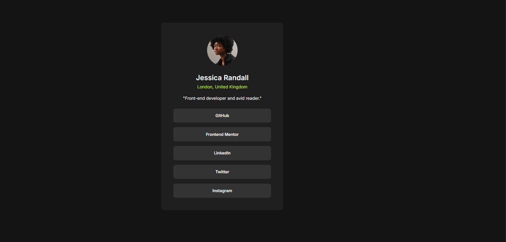

# Frontend Mentor - Social links profile

## Table of contents

- [Overview](#overview)
  - [Screenshot](#screenshot)
  - [Links](#links)
- [My process](#my-process)
  - [Built with](#built-with)
  - [What I learned](#what-i-learned)
  - [Continued development](#continued-development)
  - [Useful resources](#useful-resources)
- [Author](#author)

## Overview

### Screenshot

### Links

- Solution URL: [Solution](https://github.com/AskArtwentythree/Social-links-profile)
- Live Site URL: [Live Site](https://social-links-profile-kappa-ten.vercel.app/)

## My process

### Built with

- Semantic HTML5 markup
- CSS custom properties
- Flexbox
- BEM

### What I learned

I improved my skills in flexbox and BEM.

### Continued development

I would like to improve myself in flexbox.

### Useful resources

- [wakamaifondue](https://wakamaifondue.com/beta/) - This helped me for knowing the weights of variable font

## Author

- Website - [Social links profile](https://social-links-profile-kappa-ten.vercel.app/)
- Frontend Mentor - [@AskArtwentythree](https://www.frontendmentor.io/profile/AskArtwentythree)
